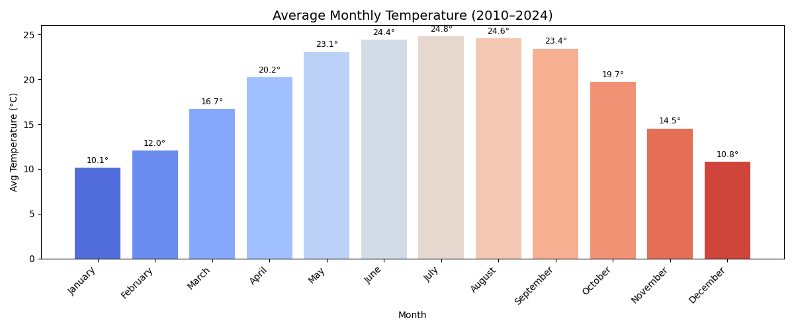
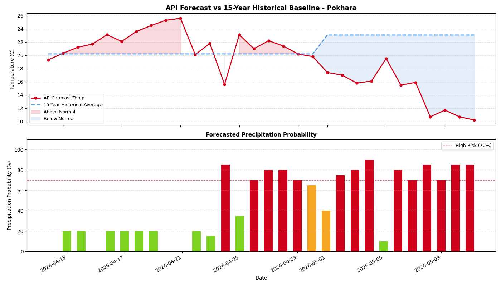
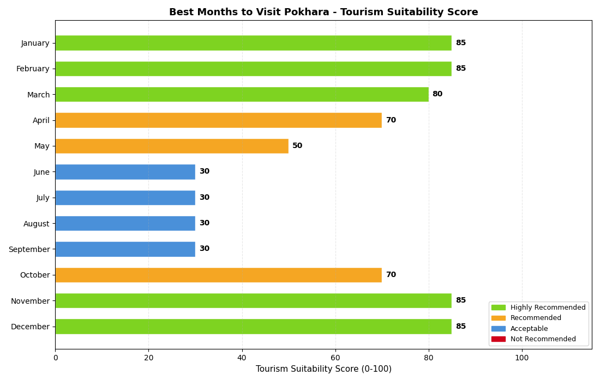
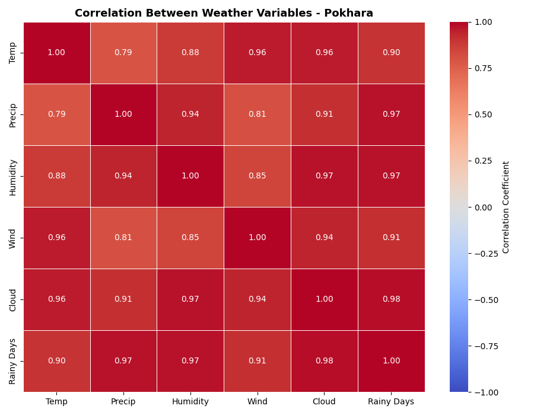
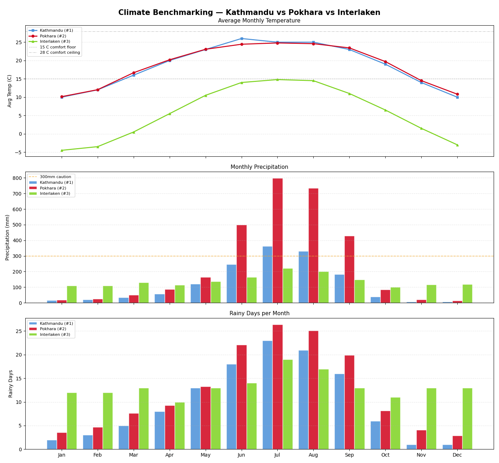

# Pokhara Weather Analysis

A Python data analytics pipeline that collects weather data from multiple sources, loads it into a MySQL database, and runs descriptive, predictive, prescriptive, KPI, and benchmarking analysis on Pokhara, Nepal's climate — mapped across four course projects.

---

## Project Structure

```
weather_analysis/
├── resources/                          # Raw input files
│   ├── pokhara_weather_seasonal_analysis.xlsx
│   ├── pokhara_climate_report.docx
│   └── pokhara_monthly_weather_historical.csv
├── Src/
│   ├── analytics/
│   │   ├── __init__.py
│   │   ├── analysis_exporter.py        # Saves charts and markdown reports
│   │   ├── data_analyser.py            # Orchestrates all analysis modules
│   │   ├── descriptive_analysis.py
│   │   ├── predictive_analysis.py
│   │   ├── prescriptive_analysis.py
│   │   ├── kpi_analysis.py
│   │   └── benchmarking.py
│   ├── __init__.py
│   ├── main.py                         # Entry point
│   ├── db_helper.py                    # MySQL connection + all CRUD operations
│   ├── api_client.py                   # Weatherbit API fetch + parser
│   ├── data_processor.py               # File ingestion (Excel, CSV, Word, API)
│   ├── doc_processor.py                # Word document parser (season descriptions)
│   ├── constants.py                    # Season colours and ordering
│   └── exporter_power_bi.py           # Exports DB tables as CSVs for Power BI
├── analysis_results/                   # All generated charts and reports
├── exports/csv_powerbi/                # Power BI CSV exports
├── WETHER_BD.sql                       # Database schema dump
├── Pokhara Weather Report.pbix         # Power BI report
└── .env                                # Credentials (not committed)
```

---

## Setup

**Requirements:** Python 3.10+, MySQL or MariaDB

```bash
pip install pandas mysql-connector-python python-dotenv requests \
            openpyxl docx2txt scikit-learn matplotlib seaborn numpy
```

Create a `.env` file in the project root:

```env
DB_HOST=localhost
DB_USER=root
DB_PASSWORD=yourpassword
DB_NAME=weather_db
API_KEY=your_weatherbit_api_key
```

---

## How to Run

```bash
# Full pipeline: ingest all data + run all analytics
python Src/main.py

# Export CSVs for Power BI separately
python Src/exporter_power_bi.py
```

---

## Database Schema

A **star schema** with one central fact table:

```
seasons          (dimension)
climate_baseline (dimension)
        ↓
monthly_historical  (main fact table)
daily_forecast      (fact table — API data)
```

| Table | Description |
|---|---|
| `seasons` | 4 named seasons with temp, precip, humidity, cloud cover, and narrative descriptions |
| `climate_baseline` | 12-month long-run normals (avg/max/min temp, precip, wind, humidity) |
| `monthly_historical` | 15-year historical monthly records linked to seasons |
| `daily_forecast` | 16-day rolling forecast from Weatherbit API |

---

## Project 1 — Data Collection & Integration

Data ingested from **5 sources** via `data_processor.py`:

| Source | File / Endpoint | Loaded Into |
|---|---|---|
| Excel — Seasonal Summary | `pokhara_weather_seasonal_analysis.xlsx` (sheet: *Seasonal Summary*) | `seasons` |
| Word document | `pokhara_climate_report.docx` | `seasons` (climate descriptions + highlights) |
| CSV | `pokhara_monthly_weather_historical.csv` | `monthly_historical` |
| Excel — Monthly Averages | same xlsx (sheet: *Monthly Averages*) | `climate_baseline` |
| Weatherbit REST API | `/v2.0/forecast/daily?city=Pokhara` | `daily_forecast` |

**Word document parsing** (`doc_processor.py`) — detects season headings via regex (e.g. `2.1 Winter (December – February)`), extracts the first three sentences as a climate description, and captures bullet points under "Key Characteristics" as `season_highlights`.

**API parsing** (`api_client.py`) — fetches 16-day daily forecast, extracts 20 fields per record including temp, precipitation probability, UV index, dew point, pressure, and wind gust, then upserts into `daily_forecast`.

---

## Project 2 — Analytics

### Descriptive Analysis (`descriptive_analysis.py`)

Answers **"What happened?"** using 15 years of monthly historical data.

**Summary statistics printed at runtime:**
- Data period (year range)
- Hottest month — month name, year, max temperature
- Coldest month — month name, year, min temperature
- Wettest month — month name, year, total precipitation
- Driest month — month name, year, total precipitation

**Chart generated:**

> 

Average monthly temperature bar chart (coolwarm palette) with per-bar labels, covering the full historical period.

---

### Predictive Analysis (`predictive_analysis.py`)

Answers **"What might happen?"** by comparing the live Weatherbit forecast against the 15-year historical monthly averages.

**For each forecast day, it computes:**
- Historical average temperature for that month
- Temperature anomaly (forecast − historical baseline)
- Decision flag: postpone / heat advisory / good conditions

**Decision logic:**
- Precipitation probability > 70% or precip > 10 mm → *"Advise trekkers to postpone"*
- Temp anomaly > +2 °C → *"Heat advisory — early morning activities only"*
- Otherwise → *"Good conditions for outdoor activities"*

**Chart generated:**

> 

Two-panel chart: API forecast temperature vs historical baseline (with above/below-normal shading), and daily precipitation probability bars colour-coded by risk level (green < 40%, orange < 70%, red ≥ 70%).

---

### Prescriptive Analysis (`prescriptive_analysis.py`)

Answers **"What should be done?"** — scores each month for tourism suitability and produces actionable recommendations.

**Scoring model (max 100 points):**

| Factor | Max Points | Criteria |
|---|---|---|
| Temperature | 30 | 15–25 °C = 30 pts, 10–15 or 25–30 °C = 15 pts |
| Precipitation | 30 | < 50 mm = 30, < 150 mm = 20, < 300 mm = 10 |
| Humidity | 20 | < 65% = 20, < 80% = 10 |
| Rainy days | 20 | < 5 days = 20, < 10 days = 10 |

**Recommendation bands:**

| Score | Label |
|---|---|
| ≥ 75 | Highly Recommended |
| ≥ 50 | Recommended |
| ≥ 30 | Acceptable |
| < 30 | Not Recommended |

**Business decisions generated automatically:**
- "Not Recommended" months → trekking agencies advised to pause outdoor operations
- "Acceptable" months → hotels advised to offer discounted rates
- Best month → peak staffing guidance

**Chart generated:**

> 

Horizontal bar chart of all 12 months ranked by suitability score, colour-coded by recommendation band.

---

## Project 3 — KPIs & Advanced Visualisation

### KPI Analysis (`kpi_analysis.py`)

Three KPI categories tracked against defined targets using `monthly_historical` data:

**Number KPIs**

| KPI | Target | Metric |
|---|---|---|
| Average Temperature | ≥ 18 °C | Mean of `avg_temp_c` across all records |
| Avg Monthly Precipitation | ≤ 300 mm | Mean of `total_precip_mm` |
| Avg Rainy Days/Month | ≤ 12 days | Mean of `rainy_days` |

**Progress KPIs**

| KPI | Target | Metric |
|---|---|---|
| % Dry Months (< 100 mm) | ≥ 40% | Months where monthly avg precip < 100 mm |
| % Comfortable Temp Months (15–28 °C) | ≥ 50% | Months where monthly avg temp is in range |

**Change KPIs**

| KPI | Target | Metric |
|---|---|---|
| YoY Temperature Change | ≤ ±1% | % change in annual avg temp, latest two years |
| YoY Precipitation Change | ≤ ±10% | % change in annual total precip, latest two years |

All KPI values, targets, data sources, frequencies, and Met/Not Met statuses are auto-exported to [`analysis_results/kpi_metadata.md`](analysis_results/kpi_metadata.md).

**Chart generated:**

> 

Seaborn correlation heatmap across 6 weather variables: temperature, precipitation, humidity, wind speed, cloud cover, and rainy days — annotated with Pearson correlation coefficients.

---

## Project 4 — Benchmarking & Insights

### Benchmarking (`benchmarking.py`)

Pokhara is benchmarked against **Kathmandu** (weather-atlas.com) and **Interlaken** (climate-data.org, 1991–2021 normals) for trekking tourism suitability.

**Scoring weights (dynamic, relative to the field):**

| Metric | Weight |
|---|---|
| Precipitation | 30% |
| Temperature (ideal range 15–28 °C) | 25% |
| Rainy days | 25% |
| Humidity | 20% |

Each metric is scored relative to the best and worst values across all three cities, producing a 0–100 composite score per city. Temperature uses a fixed ideal-range model; the rest use a lower-is-better relative scale.

**Verdict bands:**
- ≥ 75 → Excellent — highly recommended for trekking tourism
- ≥ 55 → Good — recommended with seasonal awareness
- ≥ 35 → Moderate — acceptable in specific months only
- < 35 → Poor — not recommended

**Charts generated:**

> 

Three-panel combined chart: temperature lines, grouped precipitation bars, and grouped rainy-days bars — all 12 months across all 3 cities, ordered by rank.

Full ranked benchmarking report (ranked summary table, metric winners, key insights, and verdict per city) auto-exported to [`analysis_results/benchmarking_report.md`](analysis_results/benchmarking_report.md).

---

## Power BI

Run `exporter_power_bi.py` to generate four CSVs in `exports/csv_powerbi/`.

**Import order in Power BI:**

1. `seasons.csv` — dimension table
2. `climate_baseline.csv` — dimension table
3. `monthly_historical.csv` — main fact table (includes derived columns: `date`, `temp_range_c`, `is_dry_month`, `comfort_window`)
4. `daily_forecast.csv` — fact table (includes derived column: `rain_risk` — Low / Medium / High)

**Relationships to create in Model view:**

```
seasons[season_id]      → monthly_historical[season_id]  (1:many)
climate_baseline[month] → monthly_historical[month]       (1:many)
climate_baseline[month] → daily_forecast[month]           (1:many)
```

The `.pbix` report file is included at the project root.

---

## All Output Files

| File | Generated By | Description |
|---|---|---|
| `analysis_results/desc_monthly_temperature.png` | `descriptive_analysis.py` | Avg monthly temperature bar chart |
| `analysis_results/pred_forecast_vs_baseline.png` | `predictive_analysis.py` | API forecast vs 15-yr historical baseline |
| `analysis_results/pres_tourism_score_bar.png` | `prescriptive_analysis.py` | Tourism suitability scores by month |
| `analysis_results/kpi_correlation_heatmap.png` | `kpi_analysis.py` | Weather variable correlation heatmap |
| `analysis_results/bench_city_comparison.png` | `benchmarking.py` | 3-city combined comparison (temp + precip + rainy days) |
| `analysis_results/bench_temperature_comparison.png` | `benchmarking.py` | Temperature comparison across cities |
| `analysis_results/bench_precipitation_comparison.png` | `benchmarking.py` | Precipitation comparison across cities |
| `analysis_results/bench_annual_summary.png` | `benchmarking.py` | Annual summary scores |
| `analysis_results/kpi_metadata.md` | `kpi_analysis.py` | KPI values, targets, sources, and Met/Not Met status |
| `analysis_results/benchmarking_report.md` | `benchmarking.py` | Full ranked benchmarking report with insights |